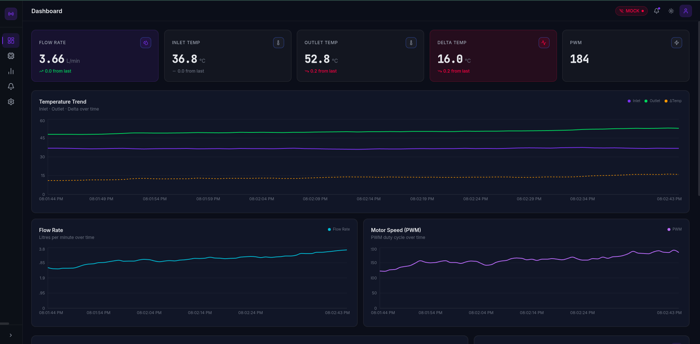

# Prototype Of Solar Based Waste Water Reclaiming System 

Full Stack Iot Based Dashboard for Real-Time Monitoring and Control of a Solar-Based Waste Water Reclaiming System


---

## 🏗️ Architecture & Tech Stack

### Frontend (Client)
- **Framework**: React.js (Vite)
- **Routing**: React Router DOM (v6)
- **Styling**: Tailwind CSS (with full Light/Dark mode token system)
- **Charts**: Recharts
- **State/Realtime**: Custom Hooks + `socket.io-client`
- **Icons**: Lucide React

### Backend (Server)
- **Framework**: Node.js + Express
- **Realtime**: Socket.IO
- **Hardware Integration**: `serialport` for Arduino communication
- **Mocking**: Built-in mock data generator for UI development without hardware

### Hardware (Arduino)
- **Sensors**: Flow rate sensor, DS18B20 Temperature sensors (Inlet/Outlet)
- **Actuators**: Motor control (PWM)
- **Libraries**: `OneWire`, `DallasTemperature`

---

## ✨ Features

- **Real-Time Data**: Sub-second latency WebSocket updates for Flow Rate, Temperatures, and PWM.
- **Dynamic Theming**: Seamless Light and Dark mode built on CSS variables and Tailwind.
- **Historical Analytics**: 60-second rolling window history with beautiful, interactive charts.
- **Smart Alerts**: Automatic severity-based alerts (e.g., Temperature Instability, Sensor Offline).
- **Responsive Design**: Mobile-friendly layout with a collapsible sidebar and clean grid system.
- **Dual Modes**: Run in `MOCK` mode for software development or `REAL` mode for actual hardware monitoring.

---

## 🚀 Getting Started

### 1) Backend Setup (Node.js)

The backend handles serial communication with the Arduino and broadcasts it via WebSockets.

```bash
cd server
npm install
cp .env.example .env
```

**Configure `server/.env`**:
You can run the server in two modes:

*Option A: MOCK Mode (No Arduino required)*
```env
MODE=MOCK
PORT=3001
CORS_ORIGIN=http://localhost:5173
```

*Option B: REAL Mode (Connects to Arduino)*
```env
MODE=REAL
PORT=3001
CORS_ORIGIN=http://localhost:5173
SERIAL_PORT=/dev/ttyACM0  # Linux: /dev/ttyACM0 or /dev/ttyUSB0. Windows: COM3
SERIAL_BAUD=9600
```

**Start the Server:**
```bash
npm start
```

### 2) Frontend Setup (React)

```bash
cd client
npm install
cp .env.example .env
```

**Configure `client/.env`**:
Ensure it points to your backend.
```env
VITE_API_URL=http://localhost:3001
```

**Start the Dashboard:**
```bash
npm run dev
```
Open **http://localhost:5173** in your browser.

---

## 🔌 Hardware Setup (Arduino)

The Arduino sketch is located in `arduino/iot_dashboard/`.

### Dependencies
Install these in the Arduino IDE (Tools → Manage Libraries):
- **OneWire**
- **DallasTemperature**

### Wiring Guide
- **DS18B20 Temp Sensors** (Inlet & Outlet) share a single 1-Wire bus:
  - DATA → **D4** (Requires a **4.7kΩ** pull-up resistor to 5V)
  - VCC → **5V**
  - GND → **GND**
- **Motor/Flow Sensor**: Wiring depends on your specific PID controller/driver setup.

### Data Protocol
The Arduino sends data via Serial (9600 baud) every 1 second as a newline-delimited JSON string:
```json
{"flowRate":2.45,"inletTemp":32.5,"outletTemp":45.2,"deltaTemp":12.7,"pwm":130}
```

*Note: When running the Node.js server in `REAL` mode, ensure the Arduino IDE Serial Monitor is CLOSED, or the server will fail to connect to the port.*

---

## 📁 Project Structure

```
minorProject/
├── arduino/                 # Arduino C++ Sketch
├── server/                  # Express + Socket.IO Backend
│   ├── src/
│   │   ├── index.js         # Main server entry
│   │   ├── mockData.js      # Generator for MOCK mode
│   │   ├── serialReader.js  # Arduino serial parser
│   │   └── validate.js      # Data normalization
│   └── package.json
│
└── client/                  # React Frontend
    ├── src/
    │   ├── components/      # UI, Charts, and Layout components
    │   ├── hooks/           # Centralized state (useSensorData.js)
    │   ├── pages/           # Route views (Dashboard, Analytics, etc.)
    │   ├── services/        # API and Socket connections
    │   ├── utils/           # Formatters and helpers
    │   ├── App.jsx          # Router & Layout Shell
    │   └── index.css        # Theme variables & Base styles
    ├── tailwind.config.js   # Custom theme tokens
    └── package.json
```

---

## 🛠️ Development & Customization

- **Theming**: Colors and modes are controlled via CSS variables in `client/src/index.css`. Modify the RGB values there to instantly re-skin the app.
- **Adding Charts**: New charts can be added trivially using the `ChartWrapper` component by passing a simple `lines` configuration object.
